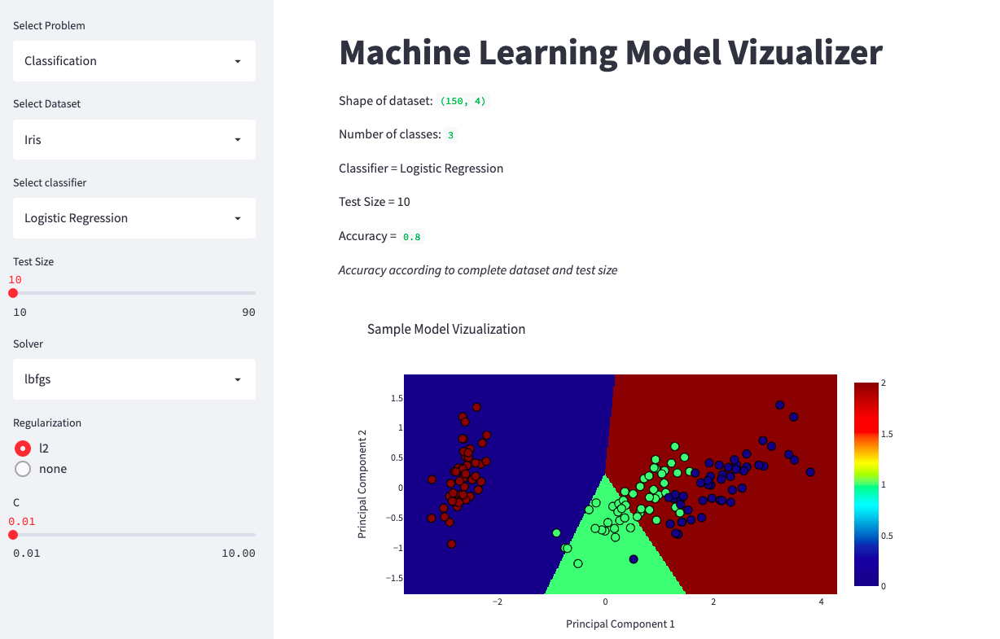
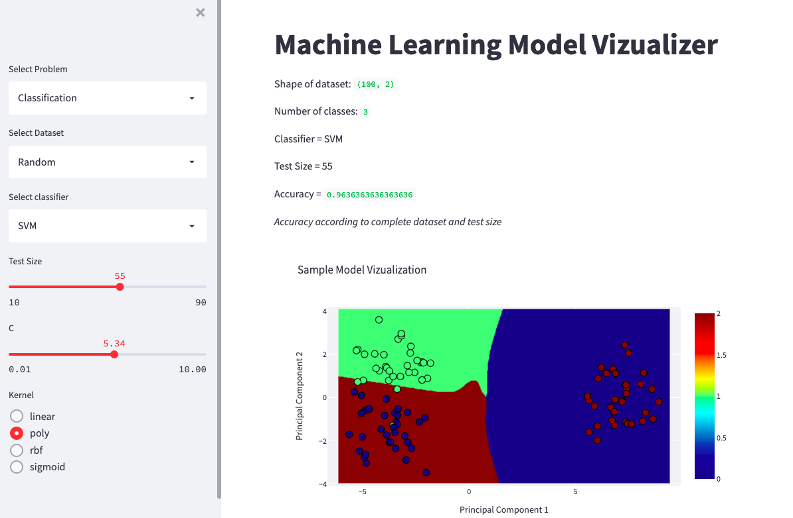
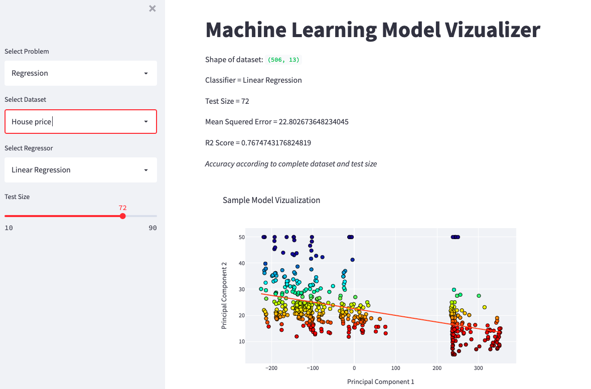
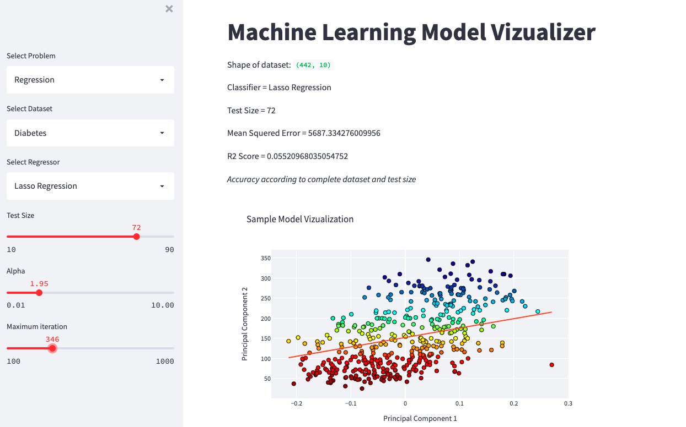

<h1> Machine-Learning-Model-Visualizer</h1>

 Demonstration of various Machine Learning Classification and Regression Models over several most popular and random datasets with real time hyper parameter tuning.

 ## App Includes:

 * Classification Models

 * Regression Models

### Classification Models:

#### * Logistic Regression

Logistic model is a statistical model that models the probability of one event taking place by having the log-odds for the event be a linear combination of one or more independent variables. In regression analysis, logistic regression is estimating the parameters of a logistic model.

Image of app window:

#### * K Nearest Neighbors:

K-nearest neighbors algorithm is a non-parametric supervised learning method first developed by Evelyn Fix and Joseph Hodges in 1951, and later expanded by Thomas Cover. It is used for classification and regression. In both cases, the input consists of the k closest training examples in a data set.

#### * Support Vector Machines

Support Vector Machine(SVM) is a supervised machine learning algorithm used for both classification and regression. Though we say regression problems as well its best suited for classification. The objective of SVM algorithm is to find a hyperplane in an N-dimensional space that distinctly classifies the data points.

Image of app window:

#### * Random Forest

Random forest is a Supervised Machine Learning Algorithm that is used widely in Classification and Regression problems. It builds decision trees on different samples and takes their majority vote for classification and average in case of regression.

### Regression Models:

#### * Linear Regression

Linear regression is a linear approach for modelling the relationship between a scalar response and one or more explanatory variables. The case of one explanatory variable is called simple linear regression; for more than one, the process is called multiple linear regression.

Image of app window:

#### * Ridge Regression

Ridge regression is a method of estimating the coefficients of multiple-regression models in scenarios where linearly independent variables are highly correlated. It has been used in many fields including econometrics, chemistry, and engineering.

#### * Lasso Regression

Lasso regression is a type of linear regression that uses shrinkage. Shrinkage is where data values are shrunk towards a central point, like the mean. The lasso procedure encourages simple, sparse models (i.e. models with fewer parameters).

Image of app window:

#### * Elastic Net Regression

In the fitting of linear or logistic regression models, the elastic net is a regularized regression method that linearly combines the L₁ and L₂ penalties of the lasso and ridge methods.

